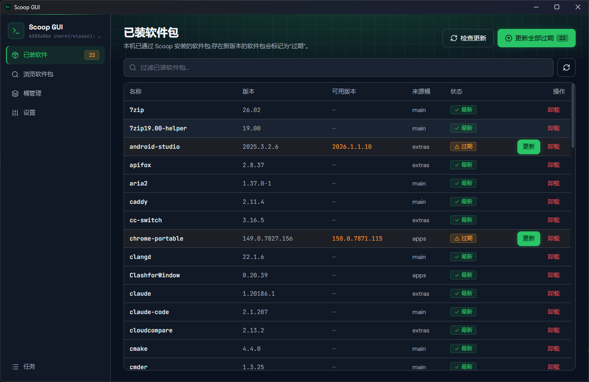

<div align="center">


# Scoop GUI

**Windows 上 [Scoop](https://scoop.sh) 命令行包管理器的图形化桌面客户端**

[](https://github.com/nvrenshiren/scoopUI/actions/workflows/ci.yml)
[](https://github.com/nvrenshiren/scoopUI/releases)
[](LICENSE)
[](https://github.com/nvrenshiren/scoopUI/releases)
[](https://tauri.app)
[](https://react.dev)

简体中文 | [English](README.en.md)



</div>

---

把命令行才能完成的软件包浏览、搜索、安装、卸载、更新、桶(bucket)管理转换为可视化操作;首次启动时若本机未安装 Scoop,可在应用内完成官方安装脚本的参数化协助安装。使用 **Rust(Tauri 2)+ React 19 + shadcn/ui + Tailwind CSS v4** 开发,安装包体积小、内存占用低。

## 功能特性

- **已装软件包** — 列表展示、过期标记(`scoop status` 比对)、单包更新/卸载、一键批量更新全部过期包
- **浏览与搜索** — 已添加桶内全部可装软件包,关键字即时过滤,单包安装
- **软件包详情** — `scoop info` 键值信息 + 随安装状态变化的操作按钮
- **桶管理** — 已添加桶列表、Scoop 官方已知桶清单、添加(含自定义 repo)/移除桶
- **任务队列** — 所有写操作(安装/卸载/更新/桶增删/装 Scoop)统一排队顺序执行,实时日志流、可取消(终止整棵进程树)、失败可重试
- **首启协助安装 Scoop** — 检测 `scoop` 可用性;未安装时呈现官方 `install.ps1` 全部参数(ScoopDir / ScoopGlobalDir / ScoopCacheDir / Proxy / NoProxy / ProxyCredential / ProxyUseDefaultCredentials / RunAsAdmin)的可填写表单,一次确认后执行,支持 UAC 提权路径,配置本机持久化供重装复用
- **中英双语** — 首启二选一,设置页随时切换、立即生效并持久化
- **三主题** — 暗 / 亮 / 跟随系统,暗色默认(终端 run-green 设计语言)
- **单实例** — 重复启动自动唤起并聚焦已有窗口

## 安装

### 下载安装包(推荐)

前往 [Releases](https://github.com/nvrenshiren/scoopUI/releases) 下载最新的 `*-setup.exe` 安装包运行即可。

> `latest` 预发布版本为滚动构建:master 分支每次提交都会由 CI 自动重新编译并更新安装包。

**系统要求**:Windows 10 / 11(需要 [WebView2 Runtime](https://developer.microsoft.com/microsoft-edge/webview2/),Win 11 与近年 Win 10 已内置);安装模式为当前用户,无需管理员权限。

### 从源码构建

前置:[Rust](https://www.rust-lang.org/tools/install)(stable)、[Node.js](https://nodejs.org) ≥ 20。

```bash
git clone https://github.com/nvrenshiren/scoopUI.git
cd scoopUI
npm install
npm run tauri build   # 产出 NSIS 安装包 → src-tauri/target/release/bundle/nsis/
```

## 技术架构

```
src/                 React 19 + TypeScript 前端(Vite 8)
  index.css          Tailwind v4 @theme:设计系统 token → shadcn 语义变量
  api.ts             Tauri IPC 封装;非 Tauri 环境自动降级 mock(浏览器可预览全部 UI)
  store.ts           zustand 全局状态:Boot Sequence、数据刷新、任务事件、实体状态推导
  i18n.ts            中英全量字典
  components/ui/     shadcn/ui 组件(Radix + cva,按设计系统定制)
  pages/             启动检测/协助安装 · 语言选择 · 已装 · 浏览 · 桶 · 设置
  components/        详情对话框 · 任务进度浮层 · 空态/错误态 等
src-tauri/           Rust 后端
  src/scoop.rs       scoop 定位(shims 多候选)与子进程执行(无窗口、PATH 注入)
  src/parse.rs       CLI 文本表格解析(dash 分隔行定位列边界,附真实输出单测)
  src/jobs.rs        任务顺序队列:状态机、逐行事件流、taskkill 进程树取消
  src/installer.rs   install.ps1 runner 生成(常规 / UAC 提权双路径)
  src/settings.rs    %APPDATA%\scoop-gui\config.json 持久化(语言/主题/安装配置)
  src/commands.rs    全部 IPC 命令(读命令 spawn_blocking,写命令入队)
```

产品需求、业务流程与状态机契约见 [docs/prd/](docs/prd/),设计系统见 [docs/design/systems/web.md](docs/design/systems/web.md)。

## 开发与测试

```bash
npm run tauri dev    # 开发模式(热更新;首次 Rust 编译约 10 分钟)
npm run dev          # 仅前端,浏览器 mock 模式预览 UI(无需 Rust)
npm run build        # tsc 类型检查 + vite 产物构建
cd src-tauri && cargo test   # 解析器 / 安装脚本生成 单元测试(基于真实 scoop 输出样例)
```

## 技术栈

| 层 | 技术 |
| --- | --- |
| 桌面框架 | [Tauri 2](https://tauri.app)(Rust) |
| 前端 | [React 19](https://react.dev) + TypeScript + [Vite 8](https://vite.dev) |
| UI 组件 | [shadcn/ui](https://ui.shadcn.com)([Radix UI](https://www.radix-ui.com) + [Tailwind CSS v4](https://tailwindcss.com)) |
| 状态管理 | [zustand](https://zustand.docs.pmnd.rs) |
| 图标 / 通知 | [lucide-react](https://lucide.dev) / [Sonner](https://sonner.emilkowal.ski) |

## 参与贡献

欢迎 Issue 与 PR!请先阅读 [CONTRIBUTING.md](CONTRIBUTING.md) 了解开发环境搭建、提交规范与 PR 流程。

## License

[MIT](LICENSE)

## 致谢

- [Scoop](https://scoop.sh) — 本项目服务的 Windows 命令行包管理器
- [Tauri](https://tauri.app) — 轻量安全的桌面应用框架
- [shadcn/ui](https://ui.shadcn.com) — 优雅的 React 组件方案
