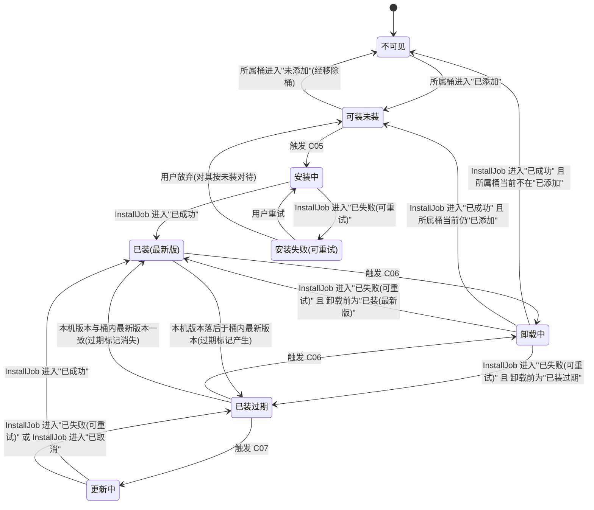
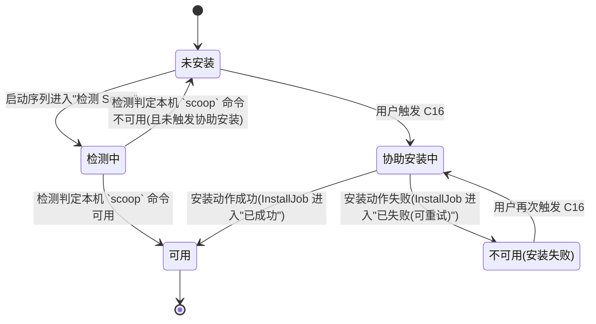
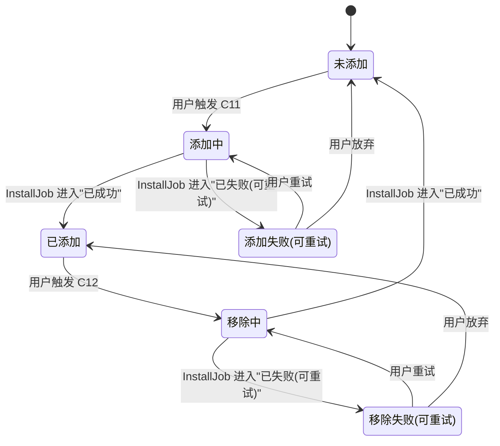
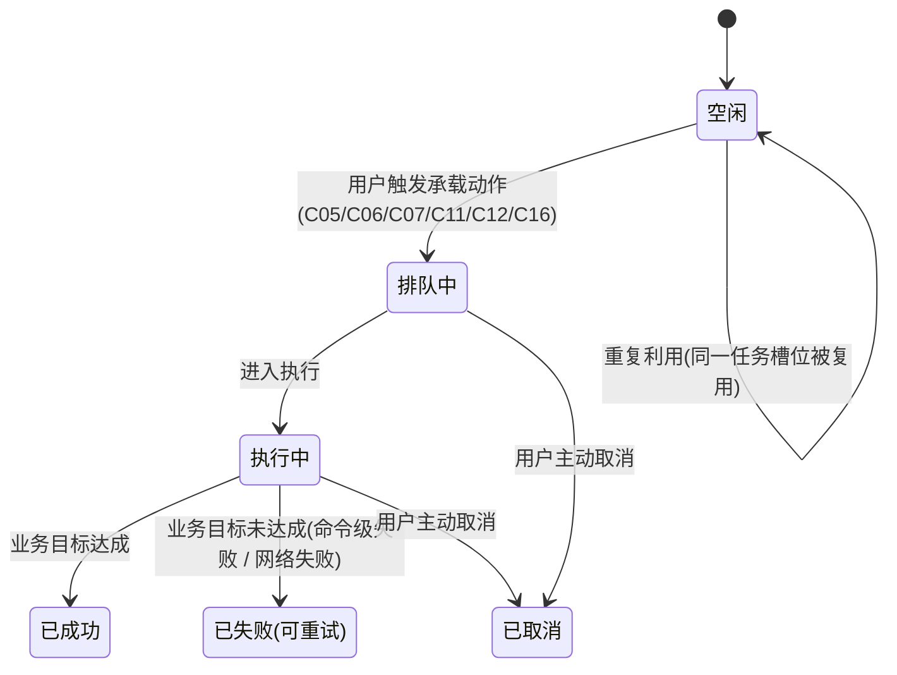
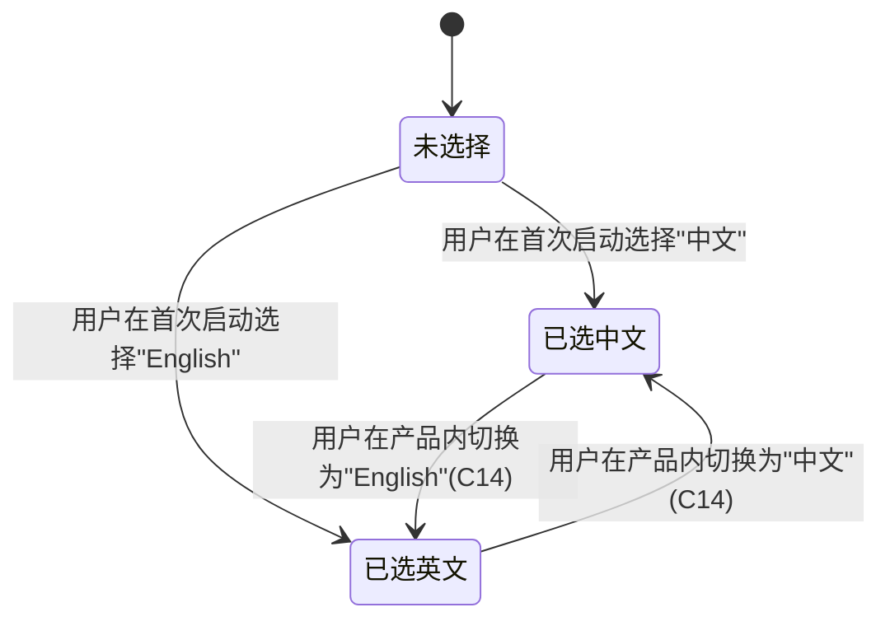
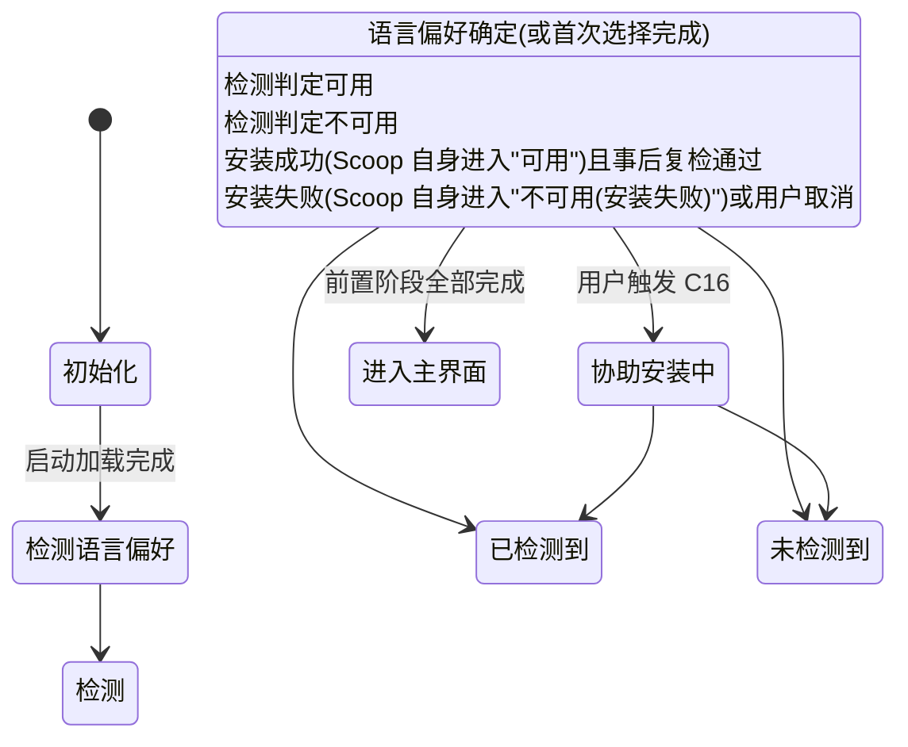

# 业务流程与实体状态机 · scoop-gui

> 文档层级:模块级契约 · 业务流程与实体状态机
> 适用范围:scoop-gui 模块(本项目唯一模块)
> 上游依赖:
> - `docs/prd/project.md`(已通过用户审批)
> - `docs/prd/roles.md`(已通过用户审批)
> - `docs/prd/glossary.md`(已通过用户审批)
> 下游引用:模块 PRD / 页面 PRD
>
> **单一出现原则**:本文档是本模块全部业务流程与实体状态机的**唯一产出位置**;模块 PRD、页面 PRD 引用本文档的状态机时,只允许用本文档定义的状态名与流转规则,不得自行复述或改写。

---

## 第 1 节 · 业务流程

本节列出本模块涉及的端到端业务流程,每条流程以"业务目标 → 触发条件 → 主要步骤 → 异常分支 → 业务结果"描述。所有动词与名词均沿用 `docs/prd/glossary.md` 定义;不引入未在术语表中出现的动作。

### 1.1 首次启动流程(应用启动序列)

- **业务目标**:在用户首次打开 scoop-gui 时,把"界面语言选择"与"Scoop 是否可用"两件事一并完成,使产品能够进入主界面或进入协助安装流程。
- **触发条件**:本机用户启动 scoop-gui 进程;应用启动序列(详见 2.6 节)从"初始化"开始。
- **主要步骤**:
  1. 应用启动序列由"初始化"进入"检测语言偏好":读取本机持久化的界面语言偏好。
  2. 若本机已持久化界面语言(中/英任一),界面语言状态机(详见 2.5 节)由"未选择"进入"已选中文"或"已选英文",启动序列继续推进。
  3. 若本机未持久化界面语言,先呈现首次界面语言选择(中/英二选一);用户选定并持久化后,启动序列继续推进。
  4. 启动序列由"检测语言偏好"进入"检测 Scoop":对"本机 `scoop` 命令是否可用"做检查。
  5. 检测结果若为"已检测到 Scoop",启动序列直接进入"进入主界面"。
  6. 检测结果若为"未检测到 Scoop",启动序列进入"协助安装中",把 C16(协助安装 Scoop)的能力入口交给用户。
  7. 用户在协助安装流程中完成 Scoop 安装且判定为"可用"后,启动序列进入"进入主界面"。
- **异常分支**:
  - 协助安装过程中失败:Scoop 自身状态机进入"不可用(安装失败)",启动序列保留在"协助安装中",用户被允许重试;
  - 用户在协助安装流程中取消操作:Scoop 自身状态保留为"未安装"(若未真正发起过安装)或回到"不可用(安装失败)";启动序列不进入"进入主界面"。
- **业务结果**:
  - 进入"进入主界面"后,主界面的可见业务对象(已装软件包、可装软件包、桶、过期项)才开始被产品读取与呈现;
  - 已选定的界面语言立刻生效,且在本机持久化。

### 1.2 日常主界面流程

- **业务目标**:为用户提供一个集中浏览点,使其在不执行任何写操作的前提下,能够查看已装软件包、可装软件包、过期标记与桶清单。
- **触发条件**:应用启动序列进入"进入主界面"后,用户停留在主界面的任一时刻。
- **主要步骤**:
  1. 产品读取本机 Scoop 给出的"已装软件包列表"与"已添加桶中可装软件包列表",分别维持其状态;
  2. 产品对每个已装软件包比对当前本机版本与桶内最新版本,产生"过期"或非过期标记;
  3. 用户可触发 C01 / C02 / C03 / C04 / C09 / C10 中的任一项,切换主界面内不同区段的呈现内容;
  4. 用户可从主界面进入各项写操作流程(1.3 / 1.4 / 1.5 / 1.6 / 1.7)或进入设置项(1.8)。
- **异常分支**:
  - Scoop 在产品运行期间出现命令级失败:对应实体(应用包 / 桶 / InstallJob)按各自的状态机落入失败态;主界面对该等失败项给出提示,但不强制刷新全量数据;
  - 用户的本机 Scoop 整体不可用(产品运行期间再次失效):主界面相应区段显示"无法读取",并把该事实以业务语言呈现;**不**触发协助安装 —— 协助安装仅限首次启动场景。
- **业务结果**:用户在未发起任何安装/卸载/更新/桶变更动作的前提下,可完整浏览主界面所覆盖的只读信息。

### 1.3 单包安装流程

- **业务目标**:把一个可装软件包(已添加桶中存在、本机未装)部署到本机。
- **触发条件**:用户在主界面或搜索结果中选定一个"可装未装"的应用包,触发 C05。
- **主要步骤**:
  1. 产品读取用户选定的应用包对应的桶与版本,生成一条安装任务(InstallJob)。
  2. InstallJob 由"空闲"进入"排队中",并按既定顺序进入"执行中"。
  3. 该应用包 App 状态机同步由"可装未装"进入"安装中"。
  4. 执行结束:
     - 成功:InstallJob 进入"已成功";App 进入"已装(最新版)"。
     - 失败:InstallJob 进入"已失败(可重试)";App 进入"安装失败(可重试)"。
- **异常分支**:
  - 用户在"排队中"或"执行中"主动取消:InstallJob 进入"已取消";App 回到"可装未装";
  - InstallJob 失败且用户触发重试:InstallJob 重新进入"排队中";App 重新进入"安装中"。
- **业务结果**:成功安装后,该应用包在"已装软件包列表"与"可装软件包列表"中的归属发生转移 —— 从"可装未装"消失、以"已装(最新版)"出现在已装列表中。

### 1.4 单包卸载流程

- **业务目标**:把一个已装软件包从本机移除。
- **触发条件**:用户在已装软件列表(或详情)中选择一个已装软件包,触发 C06。
- **主要步骤**:
  1. 产品读取用户选定的应用包,生成一条安装任务(InstallJob;此处"安装任务"是用于承载长时操作的通用任务,具体执行为卸载语义)。
  2. InstallJob 由"空闲"进入"排队中",并按既定顺序进入"执行中"。
  3. 该应用包 App 状态机同步由"已装(最新版)"或"已装过期"进入"卸载中"。
  4. 执行结束:
     - 成功:InstallJob 进入"已成功";App 状态从"卸载中"离开 —— 因本机已不存在该部署,在业务上不再属于任何"已装"或"可装"分类(详见 2.1 节终态说明);
     - 失败:InstallJob 进入"已失败(可重试)";App 回到"已装(最新版)"或"已装过期",按卸载前的版本比对结果决定。
- **异常分支**:
  - 用户在"排队中"或"执行中"主动取消:InstallJob 进入"已取消";App 回到卸载前的状态("已装(最新版)" / "已装过期" 不变)。
- **业务结果**:成功卸载后,该应用包不再出现在"已装软件包列表";若该应用包仍属于某一已添加桶(存在"可装未装"的桶归属),则在"可装软件包列表"中重新出现;否则其业务归属从产品视角消失。

### 1.5 单包更新流程

- **业务目标**:把一个已装软件包升级到其所属桶内的最新版本,消除其过期标记。
- **触发条件**:用户在已装软件列表或详情中,针对一个标记为"已装过期"的应用包触发 C07。
- **主要步骤**:
  1. 产品为该应用包生成一条安装任务(InstallJob;承载更新语义)。
  2. InstallJob 由"空闲"进入"排队中",并按既定顺序进入"执行中"。
  3. 该应用包 App 状态机同步由"已装过期"进入"更新中"。
  4. 执行结束:
     - 成功:InstallJob 进入"已成功";App 进入"已装(最新版)",过期标记消失;
     - 失败:InstallJob 进入"已失败(可重试)";App 回到"已装过期"。
- **异常分支**:
  - 用户在"排队中"或"执行中"主动取消:InstallJob 进入"已取消";App 回到"已装过期"。
  - 对一个"已装(最新版)"的应用包,不允许触发 C07 —— 该应用包已无过期标记,业务上不存在更新对象(详见 2.1 节)。
- **业务结果**:成功更新后,该应用包的过期标记消失,在已装列表中以"已装(最新版)"呈现。

### 1.6 批量更新所有过期软件包流程

- **业务目标**:在一次操作中,逐一更新本机当前所有处于"已装过期"状态的应用包。
- **触发条件**:用户触发 C08。**前提**:主界面(或同等视图)对当前已装软件包的过期比对已经完成,产品已收集到一份"过期项清单"。
- **主要步骤**:
  1. 产品列出当前"已装过期"应用包作为本次批量更新的对象清单;若清单为空,则本次流程立即结束(无对象可更新)。
  2. 用户对该清单一次性确认,随后产品按既定顺序为清单中的每个对象依次生成安装任务(InstallJob)。
  3. 对每个对象,InstallJob 依次进入"排队中" → "执行中"。
  4. 对每个对象的 App 状态依次由"已装过期"进入"更新中"。
  5. 每一项执行结束:
     - 成功:对应 InstallJob 进入"已成功";对应 App 进入"已装(最新版)";
     - 失败:对应 InstallJob 进入"已失败(可重试)";对应 App 回到"已装过期"。
  6. 全部对象执行完,给出批量结果汇总。
- **异常分支**:
  - 批量执行过程中用户取消:已"排队中"或"执行中"的任务按"已取消"结束,App 回到"已装过期";已结束的任务(无论成功或失败)保留其结果;
  - 单项执行失败:不影响后续项继续;失败的项保留"已失败(可重试)",用户可对单一项重试(等同于 1.5 单包更新流程的重试路径)。
- **业务结果**:批量完成后,本次清单中成功项的过期标记被消除;失败项仍以"已装过期"呈现,等待用户单独重试或放弃。

### 1.7 桶管理流程(添加 / 移除)

- **业务目标**:在用户视图内,对"本机已添加桶"集合执行增 / 删操作,使可装软件包 / 已知桶清单与本机状态保持一致。
- **触发条件**:用户在桶管理入口触发 C11(添加桶)或 C12(移除桶)。
- **主要步骤**:按动作拆分为两条子流程。
  - **1.7.1 添加桶(C11)**:
    1. 用户在"已知桶清单"中选定一个目标桶,触发 C11。
    2. 桶状态机中,该 Bucket 由"未添加"进入"添加中"。
    3. 执行结束:
       - 成功:该 Bucket 进入"已添加";本机"可装软件包列表"随后刷新(该桶内的"不可见"条目转为"可装未装");
       - 失败:该 Bucket 进入"添加失败(可重试)"。
    4. 用户重试:该 Bucket 重新进入"添加中"。
  - **1.7.2 移除桶(C12)**:
    1. 用户在"已添加桶列表"中选定一个目标桶,触发 C12。
    2. 桶状态机中,该 Bucket 由"已添加"进入"移除中"。
    3. 执行结束:
       - 成功:该 Bucket 进入"未添加"(本机不再保留);本机"可装软件包列表"中原本属于该桶的条目从用户视角消失(回到"不可见");
       - 失败:该 Bucket 进入"移除失败(可重试)";本机状态保持"已添加"。
    4. 用户重试:该 Bucket 重新进入"移除中"。
- **异常分支**:
  - 用户在"添加中" / "移除中"主动取消:对应 Bucket 回到动作前的状态("未添加" 或 "已添加" 不变),不进入失败态。
- **业务结果**:成功路径下,"已添加桶列表"、"可装软件包列表"与"不可见"分类三者保持一致。

### 1.8 语言切换流程

- **业务目标**:允许本机用户在任何时刻把界面语言在中文与英文之间切换,切换后立即生效,且在本机持久化。
- **触发条件**:本机用户触发 C14(切换界面语言)。注:C13(首次启动选择)走 1.1 首次启动流程。
- **主要步骤**:
  1. 用户在产品内某设置入口选择目标语言(中文 / English 二选一)。
  2. 界面语言状态机由"已选中文" / "已选英文"切换至对方状态。
  3. 产品内所有面向用户的文案按新语言立即生效。
  4. 新选择在本机持久化,覆盖旧值。
- **异常分支**:本流程不涉及命令级失败;若本机持久化失败(磁盘写入受限),则界面仍按用户本次选择即时生效,但下次启动会回到旧值 —— 该情形仅以业务语言告知用户,本流程不进入失败态。
- **业务结果**:从切换完成起,产品面向用户的所有文案以新语言呈现;后续启动按新选择显示,不再询问。

### 1.9 异常处理总则

本节明确几条横贯全流程的异常处理规则,仅以业务语言表述,不涉及命令或技术细节。

- **Scoop 整体不可用**:在"首次启动"场景下,产品必须保证用户能进入"协助安装 Scoop"流程(见 1.1);在"运行期间"再次失效时,产品**不**自动介入安装,只以业务语言在受影响区段提示"无法读取",且不改变 Scoop 自身状态机的已有状态。
- **命令级失败**:每个长时动作(安装 / 卸载 / 更新 / 桶添加 / 桶移除 / 协助安装 Scoop)对应一个 InstallJob 或对等承载对象;失败时,该对象进入"已失败(可重试)"态,被操作的实体(应用包 / 桶 / Scoop 自身)按各自状态机落入"安装失败"/"添加失败"/"移除失败"/"不可用(安装失败)"等失败态。
- **网络失败**:对需要联网获取桶元数据或软件包下载的动作,网络层失败按上述"命令级失败"同等处理,即落到对应实体的失败态与"可重试"标识;不自动切换网络或代理设置。
- **用户取消**:在"排队中"或"执行中"主动取消时,被操作的实体回到动作前的稳态,任务对象进入"已取消",且**不**进入失败态;这与"命令级失败"在业务上是两种不同的终止方式。
- **单实例违反**:若本机已有 scoop-gui 进程在运行,新启动不创建并发进程;具体如何把焦点带到已有进程,属于产品内的呈现方式(由页面 PRD 展开),不构成本流程的分支。

### 1.10 Scoop 配置编辑流程(阶段一后追加)

- **业务目标**:让用户在图形界面内读取并即时修改 Scoop 自身(`scoop config`)支持的配置项,免去手改配置文件或记忆命令行键名。
- **触发条件**:用户从主界面进入 Scoop 配置入口(C 对应 F20);进入时读取一次当前全部配置项的值。
- **主要步骤**:
  1. 产品读取本机 Scoop 当前配置(全部已显式设置过的项),未设置项以其默认值作占位呈现;
  2. 用户修改任一配置项:产品即时把该项写入 Scoop(单项独立生效),或将某项恢复为默认(清除该项);
  3. 写入成功:该项以新值呈现;写入失败:该项回滚到写入前的值,并按 1.9 总则以业务语言提示;
  4. 目录类配置项(根目录 / 全局目录 / 缓存目录)在写入或恢复默认前,先向用户明确"仅修改配置、不搬移已安装数据"的影响并二次确认。
- **异常分支**:
  - 配置整体读取失败:配置视图以业务语言提示无法读取,不阻塞其它视图(并入 1.9"命令级失败");
  - 单项写入失败:仅该项回滚并提示,不影响其它项已生效的值。
- **业务结果**:用户对 Scoop 自身配置的修改逐项即时落盘并生效。本流程**不引入新的业务实体状态机** —— 配置项无排队/执行等生命周期,不复用 InstallJob(2.4 节),异常一律并入 1.9 总则处理。

> 说明:F20 编辑的是 Scoop 自身配置体系,与"界面语言"(2.5 节)、"协助安装配置"(本产品自有持久化)相互独立;本节据"单一出现原则"不新增 2.x 实体状态机。

---

## 第 2 节 · 实体状态机

本节定义本模块全部业务实体的状态机。所有状态以中文命名;所有流转规则以业务语言表达,可用"是否处于该触发条件"判真伪。**Mermaid 状态图中所有节点名均为中文状态名,以方括号/圆括号语法表达**,避免机读时被错误归一。

### 2.1 应用包 App(单个软件包在本机中的业务状态)

**业务定义**:一个应用包 App 代表一个"在本产品视角下可被识别为业务对象"的软件包单元。其业务状态同时受"是否已添加到所属桶"、"是否已安装到本机"、"本机版本与桶内最新版本的关系"三类信息共同决定。

#### 2.1.1 状态列表

| 状态中文名 | 业务含义(可判真伪) |
| --- | --- |
| 不可见 | 该软件包在本产品的用户界面中不以任何"已装"或"可装"形式呈现。可能原因:所属桶未添加到本机,或该软件包当前不属于任何已添加桶的可装范围。 |
| 可装未装 | 该软件包属于本机"已添加桶"中的成员,但本机未安装该软件包。 |
| 安装中 | 该软件包正处于由用户触发的单次安装动作的执行过程之中。 |
| 已装(最新版) | 该软件包已安装到本机,且本机版本与其所属桶内的最新版本一致(即无过期标记)。 |
| 已装过期 | 该软件包已安装到本机,但本机版本落后于其所属桶内的最新版本(即处于"过期"标记下)。 |
| 更新中 | 该软件包正处于由用户触发的单次更新动作的执行过程之中。 |
| 卸载中 | 该软件包正处于由用户触发的单次卸载动作的执行过程之中。 |
| 安装失败(可重试) | 该软件包最近一次安装动作以失败告终,但目标(本机安装)未达成;用户可再次触发安装。 |

#### 2.1.2 状态图

#### 2.1.3 流转规则(逐条说明触发条件与输入/输出)

每条规则的"输入"指触发前的 App 状态;"输出"指流转后的 App 状态。**触发条件即"何时发生该流转"** —— 全部以业务语言可判真伪。

1. **不可见 → 可装未装**
   - 触发条件:该软件包所属的桶由"未添加"进入"已添加"。
   - 输入:`App = 不可见`。
   - 输出:`App = 可装未装`,且所属桶当前处于"已添加"。
2. **可装未装 → 不可见**
   - 触发条件:该软件包所属的桶由"已添加"被移除,即桶进入"未添加"。
   - 输入:`App = 可装未装`。
   - 输出:`App = 不可见`。
3. **可装未装 → 安装中**
   - 触发条件:用户对该软件包触发 C05(单包安装);InstallJob 由"空闲"进入"排队中"并随后进入"执行中"。
   - 输入:`App = 可装未装`。
   - 输出:`App = 安装中`,并且同一条 InstallJob 已经创建。
4. **安装中 → 已装(最新版)**
   - 触发条件:承载该次安装的 InstallJob 进入"已成功"。
   - 输入:`App = 安装中`。
   - 输出:`App = 已装(最新版)`,过期标记不存在。
5. **安装中 → 安装失败(可重试)**
   - 触发条件:承载该次安装的 InstallJob 进入"已失败(可重试)"。
   - 输入:`App = 安装中`。
   - 输出:`App = 安装失败(可重试)`,过期标记不存在(本机不存在该部署)。
6. **安装失败(可重试) → 安装中**
   - 触发条件:用户对该软件包再次触发 C05,进入新一轮安装动作。
   - 输入:`App = 安装失败(可重试)`。
   - 输出:`App = 安装中`。
7. **安装失败(可重试) → 可装未装**
   - 触发条件:用户主动放弃对失败项的处理;从产品视角,该软件包按"未装"对待。
   - 输入:`App = 安装失败(可重试)`。
   - 输出:`App = 可装未装`,并保留所属桶当前状态不变。
8. **已装(最新版) → 卸载中**
   - 触发条件:用户对该软件包触发 C06(单包卸载)。
   - 输入:`App = 已装(最新版)`。
   - 输出:`App = 卸载中`,并且同一条 InstallJob 已经创建。
9. **已装过期 → 卸载中**
   - 触发条件:用户对一个过期项同样触发 C06(允许对过期项执行卸载)。
   - 输入:`App = 已装过期`。
   - 输出:`App = 卸载中`,并且同一条 InstallJob 已经创建。
10. **卸载中 → 不可见 / 可装未装**(二选一)
    - 触发条件:承载该次卸载的 InstallJob 进入"已成功",且本机当前已不存在该软件包部署。
    - 输入:`App = 卸载中`。
    - 输出:
      - 若该软件包所属桶当前处于"未添加",则 `App = 不可见`;
      - 若该软件包所属桶当前处于"已添加",则 `App = 可装未装`。
11. **卸载中 → 已装(最新版) / 已装过期**(二选一)
    - 触发条件:承载该次卸载的 InstallJob 进入"已失败(可重试)",本机部署未被移除。
    - 输入:`App = 卸载中`。
    - 输出:
      - 若卸载前为"已装(最新版)",则 `App = 已装(最新版)`;
      - 若卸载前为"已装过期",则 `App = 已装过期`。
12. **已装过期 → 更新中**
    - 触发条件:用户对一个过期项触发 C07(单包更新)。
    - 输入:`App = 已装过期`。
    - 输出:`App = 更新中`,并且同一条 InstallJob 已经创建。
13. **更新中 → 已装(最新版)**
    - 触发条件:承载该次更新的 InstallJob 进入"已成功",本机版本已被升级并与桶内最新版本一致。
    - 输入:`App = 更新中`。
    - 输出:`App = 已装(最新版)`,过期标记消失。
14. **更新中 → 已装过期**
    - 触发条件:承载该次更新的 InstallJob 进入"已失败(可重试)",或进入"已取消"。
    - 输入:`App = 更新中`。
    - 输出:`App = 已装过期`,过期标记保留。
15. **已装(最新版) → 已装过期**(过期标记产生)
    - 触发条件:本机版本落后于所属桶内最新版本(由版本比对动作判定)。
    - 输入:`App = 已装(最新版)`。
    - 输出:`App = 已装过期`。
16. **已装过期 → 已装(最新版)**(过期标记消失)
    - 触发条件:本机版本与所属桶内最新版本一致(由版本比对动作判定)。
    - 输入:`App = 已装过期`。
    - 输出:`App = 已装(最新版)`。

#### 2.1.4 终态说明

- App 状态机**没有"自然终态"**;`App = 不可见` 与 `App = 可装未装` 都是稳态,可被进一步流转。
- `安装失败(可重试)`、`已装(最新版)`、`已装过期`、`安装中`、`更新中`、`卸载中` 都不是终态:它们各自有明确的后续流向。
- 业务上"该软件包不再被产品跟踪"的实际表现,落到 `不可见` 与 `可装未装` 两个稳态 —— 但这两个稳态仍可被所属桶与用户动作进一步流转,故不称为终态。

#### 2.1.5 异常路径

- **失败回退**:安装动作的失败以"安装中 → 安装失败(可重试)"表达;用户重试进入"安装中",用户放弃进入"可装未装"。该路径不绕过"可装未装"。
- **取消回退**:InstallJob 在"执行中"被用户取消时,App 的对应回退路径:
  - `安装中` 在 InstallJob 进入"已取消"时:`App` 回到 `可装未装`;
  - `更新中` 在 InstallJob 进入"已取消"时:`App` 回到 `已装过期`(见规则 14);
  - `卸载中` 在 InstallJob 进入"已取消"时:`App` 回到卸载前的状态(规则 11 的失败分支形式同样适用,即"动作前的稳态不变")。
- **过期标记被动更新**:不依赖用户动作,仅由产品对"本机版本 vs 桶内最新版本"的定期或触发式比对驱动(规则 15 / 16)。这种由比对触发的状态变化,不在"安装失败"或"重试"概念内。

---

### 2.2 Scoop 自身(本机 Scoop 命令的可用性)

**业务定义**:Scoop 自身状态机刻画的是"本机 `scoop` 命令当前是否可用",是首次启动序列(见 1.1)以及"产品在运行期间是否可继续使用 Scoop 相关能力"的依据。

#### 2.2.1 状态列表

| 状态中文名 | 业务含义(可判真伪) |
| --- | --- |
| 未安装 | 本机不存在可被调用的 `scoop` 命令;首次启动检测的结果之一。 |
| 检测中 | scoop-gui 正在执行"本机 `scoop` 命令是否可用"的检查动作。 |
| 可用 | 本机存在可被调用的 `scoop` 命令,且调用结果正常。 |
| 不可用(安装失败) | 本机存在 `scoop` 命令但调用失败,或最近一次协助安装动作以失败告终,且本次安装动作的总体目标(本机具备可用 Scoop)未达成。 |
| 协助安装中 | 用户已触发 C16(协助安装 Scoop),安装动作的执行过程正在进行。 |

#### 2.2.2 状态图

#### 2.2.3 流转规则

1. **未安装 → 检测中**
   - 触发条件:Boot Sequence 进入"检测 Scoop"阶段。
   - 输入:`Scoop 自身 = 未安装`。
   - 输出:`Scoop 自身 = 检测中`。
2. **检测中 → 可用**
   - 触发条件:检测动作判定本机 `scoop` 命令可用。
   - 输入:`Scoop 自身 = 检测中`。
   - 输出:`Scoop 自身 = 可用`。
3. **检测中 → 未安装**
   - 触发条件:检测动作判定本机 `scoop` 命令不可用,且用户尚未触发协助安装。
   - 输入:`Scoop 自身 = 检测中`。
   - 输出:`Scoop 自身 = 未安装`(回退至"未安装"基态)。
4. **未安装 → 协助安装中**
   - 触发条件:用户在前述检测结果为"未检测到 Scoop"的前提下,触发 C16(协助安装 Scoop)。
   - 输入:`Scoop 自身 = 未安装`。
   - 输出:`Scoop 自身 = 协助安装中`,同时创建一条对应的 InstallJob。
5. **协助安装中 → 可用**
   - 触发条件:承载该次安装的 InstallJob 进入"已成功",并且事后判定本机 `scoop` 命令可用。
   - 输入:`Scoop 自身 = 协助安装中`。
   - 输出:`Scoop 自身 = 可用`。
6. **协助安装中 → 不可用(安装失败)**
   - 触发条件:承载该次安装的 InstallJob 进入"已失败(可重试)",且本机 Scoop 仍未达成"可用"。
   - 输入:`Scoop 自身 = 协助安装中`。
   - 输出:`Scoop 自身 = 不可用(安装失败)`。
7. **不可用(安装失败) → 协助安装中**
   - 触发条件:用户再次触发 C16。
   - 输入:`Scoop 自身 = 不可用(安装失败)`。
   - 输出:`Scoop 自身 = 协助安装中`,同时创建一条新的 InstallJob。

#### 2.2.4 终态说明

- `可用` 是 Scoop 自身状态机的稳态终态:在本项目职责范围内(见 `docs/prd/project.md` 第 3.3 节"业务边界"),产品不对 Scoop 自身的卸载、升级、修复等维护动作负责,因此一旦 `Scoop 自身 = 可用`,在本模块语义下不再流转至其它状态。
- `未安装`、`检测中`、`协助安装中`、`不可用(安装失败)` 都不是终态。

#### 2.2.5 异常路径

- **取消**:在"协助安装中",用户主动取消时,InstallJob 进入"已取消";`Scoop 自身` 回到 `未安装`。
- **失败后重试**:`不可用(安装失败)` 不阻塞用户的重试意愿;按规则 7 进入新一轮 `协助安装中`。
- **运行期间再次失效**:本产品在运行期间**不**主动改变 `Scoop 自身` 的状态;若产品在主界面运行期间发现 `scoop` 调用整体不可用,产品以业务语言在受影响区段提示,但 `Scoop 自身` 状态机在本项目范围内不进入"协助安装中"。这是与首次启动场景的关键差异。

---

### 2.3 桶 Bucket(本机已添加桶)

**业务定义**:Bucket 状态机刻画的是"某一个具体桶在本机侧的业务状态",即该桶在"本机已添加桶列表"中的位置与最近一次增 / 删动作的执行结果。

#### 2.3.1 状态列表

| 状态中文名 | 业务含义(可判真伪) |
| --- | --- |
| 未添加 | 该桶不在本机已添加桶列表中。 |
| 添加中 | 该桶正处于"添加桶"动作的执行过程之中。 |
| 已添加 | 该桶已成功添加并保留在本机已添加桶列表中。 |
| 移除中 | 该桶正处于"移除桶"动作的执行过程之中。 |
| 添加失败(可重试) | 该桶最近一次"添加桶"动作以失败告终;本机状态仍为"未添加",用户可再次触发添加。 |
| 移除失败(可重试) | 该桶最近一次"移除桶"动作以失败告终;本机状态仍为"已添加",用户可再次触发移除。 |

#### 2.3.2 状态图

#### 2.3.3 流转规则

1. **未添加 → 添加中**
   - 触发条件:用户从"已知桶清单"中选定目标桶,触发 C11。
   - 输入:`Bucket = 未添加`。
   - 输出:`Bucket = 添加中`,并创建一条对应的 InstallJob。
2. **添加中 → 已添加**
   - 触发条件:承载该次添加的 InstallJob 进入"已成功"。
   - 输入:`Bucket = 添加中`。
   - 输出:`Bucket = 已添加`,桶内软件包进入"可装未装"或"不可见"分类。
3. **添加中 → 添加失败(可重试)**
   - 触发条件:承载该次添加的 InstallJob 进入"已失败(可重试)"。
   - 输入:`Bucket = 添加中`。
   - 输出:`Bucket = 添加失败(可重试)`,本机状态保持"未添加"。
4. **添加失败(可重试) → 添加中**
   - 触发条件:用户对该桶再次触发 C11(对失败项的重试)。
   - 输入:`Bucket = 添加失败(可重试)`。
   - 输出:`Bucket = 添加中`,创建新的 InstallJob。
5. **添加失败(可重试) → 未添加**
   - 触发条件:用户主动放弃对失败项的处理。
   - 输入:`Bucket = 添加失败(可重试)`。
   - 输出:`Bucket = 未添加`。
6. **已添加 → 移除中**
   - 触发条件:用户从"已添加桶列表"中选定目标桶,触发 C12。
   - 输入:`Bucket = 已添加`。
   - 输出:`Bucket = 移除中`,并创建一条对应的 InstallJob。
7. **移除中 → 未添加**
   - 触发条件:承载该次移除的 InstallJob 进入"已成功"。
   - 输入:`Bucket = 移除中`。
   - 输出:`Bucket = 未添加`,原本属于该桶的桶内软件包回归到"不可见"分类。
8. **移除中 → 移除失败(可重试)**
   - 触发条件:承载该次移除的 InstallJob 进入"已失败(可重试)"。
   - 输入:`Bucket = 移除中`。
   - 输出:`Bucket = 移除失败(可重试)`,本机状态保持"已添加"。
9. **移除失败(可重试) → 移除中**
   - 触发条件:用户对该桶再次触发 C12(对失败项的重试)。
   - 输入:`Bucket = 移除失败(可重试)`。
   - 输出:`Bucket = 移除中`,创建新的 InstallJob。
10. **移除失败(可重试) → 已添加**
    - 触发条件:用户主动放弃对失败项的处理。
    - 输入:`Bucket = 移除失败(可重试)`。
    - 输出:`Bucket = 已添加`。

#### 2.3.4 终态说明

- Bucket 状态机没有终态;`未添加` 与 `已添加` 都是稳态,可被用户动作进一步流转。
- `添加中`、`移除中`、`添加失败(可重试)`、`移除失败(可重试)` 都不是终态。

#### 2.3.5 异常路径

- **取消**:在"添加中"或"移除中"用户主动取消时,InstallJob 进入"已取消",对应 Bucket 回到动作前的稳态:
  - `添加中` 取消 → `未添加`;
  - `移除中` 取消 → `已添加`。
  这条路径与"添加失败" / "移除失败"在业务上是两种不同的终止方式。
- **失败后路径**:见规则 4 / 9(重试)和规则 5 / 10(放弃)。

---

### 2.4 安装任务 InstallJob(一条具体的长时操作)

**业务定义**:InstallJob 是用于承载"安装 / 卸载 / 更新 / 桶添加 / 桶移除 / 协助安装 Scoop"等所有长时动作的统一任务对象,在产品运行期间某一刻必然处于下述六态之一。

#### 2.4.1 状态列表

| 状态中文名 | 业务含义(可判真伪) |
| --- | --- |
| 空闲 | 该 InstallJob 槽位存在,但当前没有承载任何长时动作。 |
| 排队中 | 该 InstallJob 已创建但尚未开始执行;按既定顺序等待进入"执行中"。 |
| 执行中 | 该 InstallJob 正在执行其语义所代表的长时动作。 |
| 已成功 | 该 InstallJob 承载的动作以业务目标达成而结束。 |
| 已失败(可重试) | 该 InstallJob 承载的动作以业务目标未达成而结束,但允许用户再次触发同类动作。 |
| 已取消 | 该 InstallJob 承载的动作由用户在"排队中"或"执行中"主动终止,不属于"失败"。 |

#### 2.4.2 状态图

#### 2.4.3 流转规则

1. **空闲 → 排队中**
   - 触发条件:用户触发一个长时动作(C05 / C06 / C07 / C11 / C12 / C16 之一),产品为该动作创建一条 InstallJob。
   - 输入:`InstallJob = 空闲`。
   - 输出:`InstallJob = 排队中`,且该任务已绑定到具体的目标对象(应用包 / 桶 / Scoop 自身)。
2. **排队中 → 执行中**
   - 触发条件:产品按既定顺序将该任务推进到可执行阶段。
   - 输入:`InstallJob = 排队中`。
   - 输出:`InstallJob = 执行中`。
3. **执行中 → 已成功**
   - 触发条件:该任务承载的动作以业务目标达成而结束(本机侧状态已按预期变化)。
   - 输入:`InstallJob = 执行中`。
   - 输出:`InstallJob = 已成功`,被操作的实体(应用包 / 桶 / Scoop 自身)按各自状态机进入对应的成功态。
4. **执行中 → 已失败(可重试)**
   - 触发条件:该任务承载的动作以业务目标未达成而结束,例如命令级失败、网络失败等。
   - 输入:`InstallJob = 执行中`。
   - 输出:`InstallJob = 已失败(可重试)`,被操作的实体按各自状态机进入对应的失败态。
5. **排队中 → 已取消**
   - 触发条件:用户在"排队中"主动取消该任务。
   - 输入:`InstallJob = 排队中`。
   - 输出:`InstallJob = 已取消`,被操作的实体回到动作前的稳态(不进入失败态)。
6. **执行中 → 已取消**
   - 触发条件:用户在"执行中"主动取消该任务。
   - 输入:`InstallJob = 执行中`。
   - 输出:`InstallJob = 已取消`,被操作的实体回到动作前的稳态(不进入失败态)。
7. **已成功 / 已失败(可重试) / 已取消 → 空闲**
   - 触发条件:任务对象在产品内被复用,进入新一轮动作前回到"空闲"。
   - 输入:任一终态。
   - 输出:`InstallJob = 空闲`,新动作的重新触发按规则 1 进入新一轮 `排队中`。

#### 2.4.4 终态说明

- `已成功`、`已失败(可重试)`、`已取消` 都是 InstallJob 的终态:本任务一旦落入这三态之一,不再流转;若需继续,由产品创建新的 InstallJob 或复用同一任务槽位并按规则 7 先回到 `空闲`,再按规则 1 重启。
- `空闲`、`排队中`、`执行中` 都不是终态。

#### 2.4.5 异常路径

- **失败**:见规则 4。被操作的实体(应用包 / 桶 / Scoop 自身)按各自状态机落入对应的失败态,且全部携带"可重试"语义;用户重试时通过规则 7 回到 `空闲`,再按规则 1 重启。
- **取消**:见规则 5 / 6。被操作的实体一律回到动作前的稳态(规则口径见 2.1.5、2.2.5、2.3.5)。
- **多次重试**:允许;不存在"重试次数上限"这一业务约束 —— 若需引入上限,由后续 spec 单独覆盖,本节不预设。

---

### 2.5 界面语言 UI Language

**业务定义**:UI Language 状态机刻画的是"本机已持久化的界面语言选择"在产品运行期的状态,只覆盖"中文 / English"两套选项。

#### 2.5.1 状态列表

| 状态中文名 | 业务含义(可判真伪) |
| --- | --- |
| 未选择 | 本机当前尚未持久化任何界面语言选择;该状态仅在首次启动且用户尚未做出选择时出现。 |
| 已选中文 | 本机已持久化的界面语言为"中文";产品面向用户的所有文案以中文呈现。 |
| 已选英文 | 本机已持久化的界面语言为"English";产品面向用户的所有文案以英文呈现。 |

#### 2.5.2 状态图

#### 2.5.3 流转规则

1. **未选择 → 已选中文**
   - 触发条件:本机用户在本机尚未持久化语言偏好的前提下,在首次启动场景下选择了"中文"。
   - 输入:`UI Language = 未选择`。
   - 输出:`UI Language = 已选中文`,并在 Boot Sequence 内使该选择立即生效。
2. **未选择 → 已选英文**
   - 触发条件:本机用户在本机尚未持久化语言偏好的前提下,在首次启动场景下选择了"English"。
   - 输入:`UI Language = 未选择`。
   - 输出:`UI Language = 已选英文`,并在 Boot Sequence 内使该选择立即生效。
3. **已选中文 → 已选英文**
   - 触发条件:本机用户触发 C14,在产品内将界面语言切换为"English"。
   - 输入:`UI Language = 已选中文`。
   - 输出:`UI Language = 已选英文`,产品面向用户的所有文案立即切换为英文。
4. **已选英文 → 已选中文**
   - 触发条件:本机用户触发 C14,在产品内将界面语言切换为"中文"。
   - 输入:`UI Language = 已选英文`。
   - 输出:`UI Language = 已选中文`,产品面向用户的所有文案立即切换为中文。

#### 2.5.4 终态说明

- UI Language 状态机没有"自然终态";`已选中文` 与 `已选英文` 都是稳态,可以再次切换。
- `未选择` 不是终态 —— 它的存在意义是"在用户做出选择之前暂时承担无偏好基态";一旦用户完成首次选择,本状态不再回到。
- "中英之外的第三语言"在业务边界上**不存在**(见 `docs/prd/project.md` 第 3.3 节"界面语言范围"),因此不引入对应的状态。

#### 2.5.5 异常路径

- **持久化失败**:见 1.8 节异常分支叙述:切换的"即时生效"与"本机持久化"是两个独立的结果,前者不受持久化失败影响;后者失败仅影响"下次启动默认值"。该情况下本状态机不引入新的失败态。
- **退出产品后再启动**:见 1.1 节:已持久化的语言选择在下一次启动时被读取,进入对应的"已选中文"或"已选英文",不再走"未选择"基态。

---

### 2.6 应用启动序列 Boot Sequence(产品启动时的整体流程阶段)

**业务定义**:Boot Sequence 是产品启动进入主界面以前所经历的、由多个阶段组成的有序流程;它不是业务实体,而是"阶段集",但因为具有清晰的、互相排斥的阶段状态,本节同样以状态机方式表达。

#### 2.6.1 状态列表

| 状态中文名 | 业务含义(可判真伪) |
| --- | --- |
| 初始化 | scoop-gui 进程已启动,但尚未开始读取任何业务信息。 |
| 检测 Scoop | 正在执行"本机 `scoop` 命令是否可用"的检查;这是用户首次启动序列的必经阶段。 |
| 检测语言偏好 | 正在读取本机持久化的界面语言偏好;若本机尚无偏好,呈现首次界面语言选择。 |
| 已检测到 Scoop | 已确认本机 `scoop` 命令可用;等待语言偏好阶段完成后可进入主界面。 |
| 未检测到 Scoop | 已确认本机 `scoop` 命令不可用;用户可决定是否触发 C16 进入协助安装。 |
| 协助安装中 | 用户已触发 C16;协助安装 Scoop 的动作正在执行;安装结果尘埃落定后回到"已检测到 Scoop"或保留在"未检测到 Scoop"。 |
| 进入主界面 | 启动序列结束;主界面开始呈现"已装软件包列表 / 可装软件包列表 / 已添加桶列表 / 过期项"等只读信息。 |

#### 2.6.2 状态图

#### 2.6.3 流转规则

1. **初始化 → 检测语言偏好**
   - 触发条件:进程启动加载完成(本地资源、翻译资源已就绪)。
   - 输入:`Boot Sequence = 初始化`。
   - 输出:`Boot Sequence = 检测语言偏好`,UI Language 状态机的读取动作随即开始。
2. **检测语言偏好 → 检测 Scoop**
   - 触发条件:本机的界面语言偏好已经确定(读取到持久化值,或用户完成了首次选择)。
   - 输入:`Boot Sequence = 检测语言偏好`,且 `UI Language ∈ {已选中文, 已选英文}`。
   - 输出:`Boot Sequence = 检测 Scoop`,Scoop 自身状态机的检测动作随即开始。
3. **检测 Scoop → 已检测到 Scoop**
   - 触发条件:检测动作判定本机 `scoop` 命令可用,Scoop 自身进入"可用"。
   - 输入:`Boot Sequence = 检测 Scoop`,`Scoop 自身 = 可用`。
   - 输出:`Boot Sequence = 已检测到 Scoop`。
4. **检测 Scoop → 未检测到 Scoop**
   - 触发条件:检测动作判定本机 `scoop` 命令不可用,Scoop 自身停留在"未安装"。
   - 输入:`Boot Sequence = 检测 Scoop`,`Scoop 自身 = 未安装`。
   - 输出:`Boot Sequence = 未检测到 Scoop`。
5. **未检测到 Scoop → 协助安装中**
   - 触发条件:本机用户触发 C16(协助安装 Scoop)。
   - 输入:`Boot Sequence = 未检测到 Scoop`,`Scoop 自身 = 未安装`。
   - 输出:`Boot Sequence = 协助安装中`,Scoop 自身进入"协助安装中"。
6. **协助安装中 → 已检测到 Scoop**
   - 触发条件:承载该次安装的 InstallJob 进入"已成功",事后复检通过,`Scoop 自身 = 可用`。
   - 输入:`Boot Sequence = 协助安装中`,`Scoop 自身 = 可用`。
   - 输出:`Boot Sequence = 已检测到 Scoop`。
7. **协助安装中 → 未检测到 Scoop**
   - 触发条件:承载该次安装的 InstallJob 进入"已失败(可重试)",或进入"已取消";Scoop 自身回到"不可用(安装失败)"或"未安装"。
   - 输入:`Boot Sequence = 协助安装中`。
   - 输出:`Boot Sequence = 未检测到 Scoop`。
8. **已检测到 Scoop → 进入主界面**
   - 触发条件:前置阶段(`检测语言偏好` 与 `检测 Scoop` / `协助安装`)全部完成,具备主界面所需全部前置条件。
   - 输入:`Boot Sequence = 已检测到 Scoop`,`Scoop 自身 = 可用`,`UI Language ≠ 未选择`。
   - 输出:`Boot Sequence = 进入主界面`。

#### 2.6.4 终态说明

- `进入主界面` 是 Boot Sequence 的唯一终态:进入该状态后,Boot Sequence 不再流转;后续主界面内的一切均不再由 Boot Sequence 承载。

#### 2.6.5 异常路径

- **协助安装失败**:见规则 7:Boot Sequence 保留在"未检测到 Scoop"或回到"未检测到 Scoop";用户可继续重试,直到该阶段最终进入"已检测到 Scoop",再按规则 8 进入"进入主界面"。
- **用户拒绝协助安装**:在"未检测到 Scoop"阶段用户不触发 C16,Boot Sequence 不进入"进入主界面";这与"协助安装失败"在业务上同源 —— "未检测到 Scoop"在该场景下是稳态,用户可在该阶段停留并随时触发 C16。
- **进入主界面后,产品运行期间再次出现的 Scoop 失效**:见 1.2 节异常分支,不在 Boot Sequence 的流转范围内。

---

## 第 3 节 · 状态机交叉关系

本节说明各实体状态机之间的相互影响,即"某个状态机的流转如何触发另一个状态机的流转"。所有陈述以业务语言可判真伪。

- **Scoop 自身 → Boot Sequence**:`Scoop 自身` 的状态直接决定 Boot Sequence 是否能进入"进入主界面":
  - `Scoop 自身 = 可用` 是 Boot Sequence 从"已检测到 Scoop"进入"进入主界面"的前提(规则 2.6.3-8);
  - `Scoop 自身 = 未安装 / 不可用(安装失败)` 是 Boot Sequence 停留在"协助安装中"或"未检测到 Scoop"的原因。
- **Boot Sequence → Scoop 自身**:Boot Sequence 进入"检测 Scoop"时,驱动 `Scoop 自身` 由"未安装"进入"检测中";Boot Sequence 进入"协助安装中"时,驱动 `Scoop 自身` 进入"协助安装中"。
- **UI Language → Boot Sequence**:仅在"检测语言偏好"阶段产生前置约束 —— `UI Language ≠ 未选择` 是 Boot Sequence 从"已检测到 Scoop"进入"进入主界面"的前置条件之一(规则 2.6.3-8)。
- **UI Language ↔ 用户主流程**:`UI Language` 在产品运行期间的切换(规则 2.5.3-3 / 4)独立于其他状态机,即切换语言不触发其它实体状态变化。
- **InstallJob → 应用包 App**:InstallJob 的执行结果直接影响 App 的状态:
  - `InstallJob = 已成功` → App 进入成功侧的对应态(规则 2.1.3-4 / 8 / 13);
  - `InstallJob = 已失败(可重试)` → App 进入失败侧的对应态(规则 2.1.3-5 / 11 / 14);
  - `InstallJob = 已取消` → App 回到动作前的稳态。
- **InstallJob → 桶 Bucket**:与对 App 的影响在结构上相同,只是被操作对象为桶(规则 2.3.3-2 / 3 / 7 / 8 等)。
- **InstallJob → Scoop 自身**:仅当 InstallJob 承载的动作是 C16 时,其结果直接影响 `Scoop 自身` 的状态(规则 2.2.3-5 / 6)。
- **桶 Bucket → 应用包 App**:桶的增删对桶内应用包的可见性产生影响:
  - 桶进入"已添加",原本属于该桶且此前为"不可见"的应用包进入"可装未装"(规则 2.1.3-1);
  - 桶进入"未添加"(移除成功),原本属于该桶的应用包回到"不可见"(规则 2.1.3-2 与规则 2.4.3-7 的组合)。
- **应用包 App → InstallJob**:App 进入"安装中 / 更新中 / 卸载中"时,均已经创建了一条相应的 InstallJob;反之,App 进入这些"中"态的前提是 InstallJob 已经从"空闲"进入"排队中"。
- **启动序列 → UI Language / Scoop 自身**:Boot Sequence 是本模块唯一的"启动期编排者",它的状态推进是 UI Language 与 Scoop 自身在启动期发生流转的唯一驱动者;在产品运行期间,UI Language / Scoop 自身 / 其它实体均不因 Boot Sequence 而变化。

---

## 第 4 节 · 文档范围声明

本文件(`docs/prd/flows/scoop-gui.md`)是模块级契约中的"业务流程与实体状态机"部分,只回答"业务如何流转、状态如何变化",与"模块 PRD"(回答"模块做什么")、"页面 PRD"(回答"页面如何呈现与交互")共同构成对本模块的完整业务契约。

**本文件不涉及**(以下条目均交由下游契约或角色负责):

- 任何具体的 UI 形态、页面布局、交互细节、文案(由页面 PRD 产出);
- 任何技术栈、框架、构建工具选型(由架构师产出);
- 任何 API 路径、接口形态、数据表结构(由架构师产出);
- 任何视觉风格、组件库、配色方案(由设计师产出);
- 任何模块内具体功能的细分与权限(由模块 PRD 产出)。

**单一出现原则**:本文件是本模块全部实体状态机与流转规则的唯一产出位置;模块 PRD、页面 PRD 在引用本文件的状态机时,只允许用本文档定义的状态名与流转规则,不得自行复述或改写;**若需要复述,即视为引入新内容,需先回到本文档更新并送审**。
